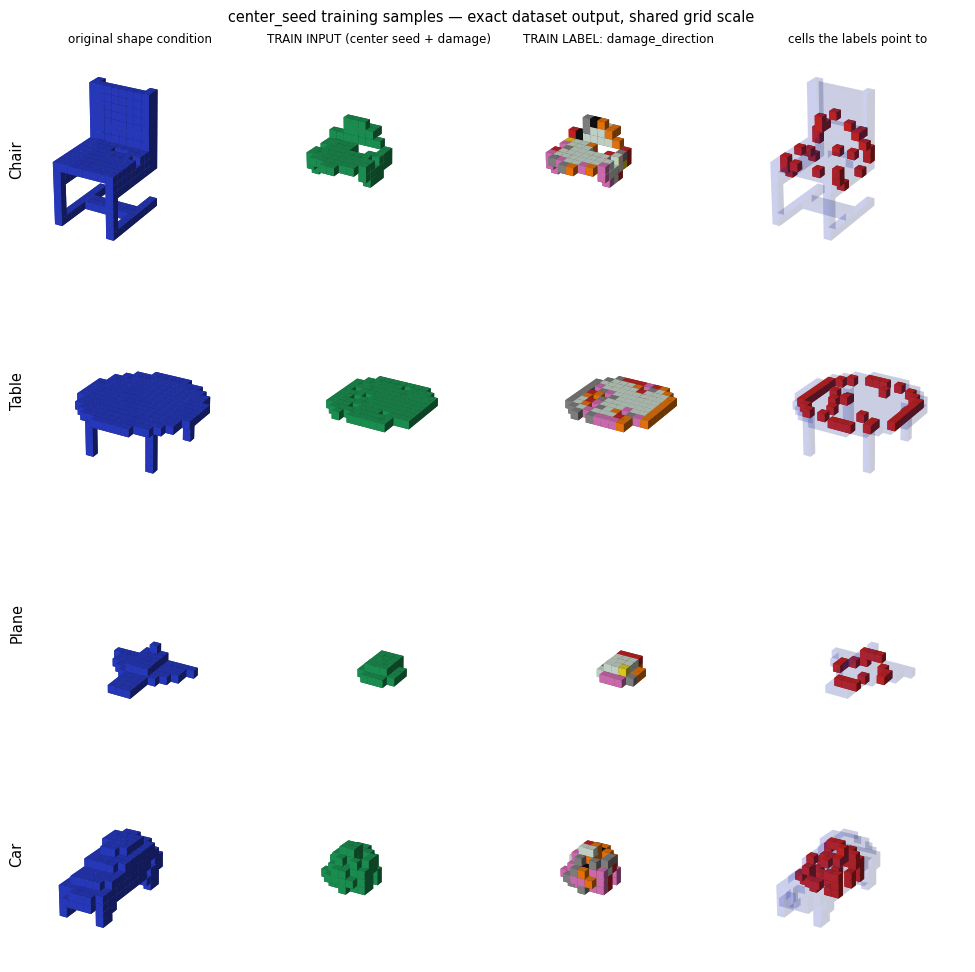

# Smart Cellular Bricks for Decentralized Shape Classification and Damage Recovery

## Install
```bash
pip install -e .
```

## Pretrained Models

- Combined model (damage + classification): [shyamsn97/cube-regen-combined-hdim-20](https://huggingface.co/shyamsn97/cube-regen-combined-hdim-20)
- ShapeNet combined model: [shyamsn97/shapenet-cube-regen-combined-hdim-48](https://huggingface.co/shyamsn97/shapenet-cube-regen-combined-hdim-48)
- Shape-conditioned damage model: [shyamsn97/cube-regen-shape-conditioned-damage-hdim-full-64](https://huggingface.co/shyamsn97/cube-regen-shape-conditioned-damage-hdim-full-64)

## Todo

- In progress: live UI


## Training
Training is driven by YAML configs and a single entry point for both local and Modal runs.

```bash
python scripts/train.py --config configs/train_combined.yaml
```

Common training runs also have Make targets:

```bash
make train-combined                       # combined damage + class, local
make train-combined-modal                 # combined damage + class, Modal
make train-damage                          # damage-only, local
make train-damage-modal                    # damage-only, Modal
make train-damage-shape-conditioned        # shape-conditioned damage-only, local
make train-damage-shape-conditioned-modal  # shape-conditioned damage-only, Modal
make train-combined-shapenet-modal         # combined on ShapeNet, Modal
make train-damage-shapenet-modal           # damage-only on ShapeNet, Modal
```

The **shape-conditioned** model swaps the class embedding for a small convolutional
encoder of the full target shape, so each cell is conditioned on the local original
occupancy around it (rather than a single per-shape class vector). Its damage
distribution includes `sphere`, `center_seed` (connected center seed + small bounded
augment damage), and surface-peeling `random` damage.

The default config trains the combined model, which predicts both:

- voxel-wise damage direction labels
- a shape-level class label

To train the same config on Modal:

```bash
python scripts/train.py --config configs/train_combined_modal.yaml
```

You can also override the configured mode:

```bash
python scripts/train.py --config configs/train_combined.yaml --mode modal
python scripts/train.py --config configs/train_combined_modal.yaml --mode local
```

### Configs

Available configs:

- `configs/train_combined.yaml`: local combined training from `data/xdata_7class.npy` and `data/ydata_7class.npy`
- `configs/train_combined_modal.yaml`: Modal combined training with the same dataset
- `configs/train_shapenet.yaml`: combined training from pre-voxelized ShapeNet folders
- `configs/train_damage.yaml`: local damage-only training
- `configs/train_damage_modal.yaml`: Modal damage-only training
- `configs/train_damage_shape_conditioned.yaml`: local shape-conditioned damage-only training
- `configs/train_damage_shape_conditioned_modal.yaml`: Modal shape-conditioned damage-only training
- `configs/train_damage_shapenet.yaml`: local ShapeNet damage-only training
- `configs/train_damage_shapenet_modal.yaml`: Modal ShapeNet damage-only training

Important sections:

```yaml
run:
  mode: local # or modal
dataset:
  source: npy # or shapenet
model:
  type: combined # or damage
training:
  epochs: 500
output:
  save_dir: combined_nca_models
```

For damage-only training, set:

```yaml
model:
  type: damage
dataset:
  filter_label: 3 # optional, for one-class damage-only training
```

Damage configs use chunk-style `sphere`/`cube` damage, weighted cross entropy for sparse nonzero boundary labels, and lower replay sampling so fresh damage examples drive early learning.

### ShapeNet

`configs/train_shapenet.yaml` expects pre-voxelized ShapeNet data arranged by category:

```text
data/shapenet_voxels/
  chair/**/*.npy
  table/**/*.npz
  03001627/**/*.binvox
```

Supported voxel formats are `.npy`, `.npz`, and `.binvox`. Edit these fields for your dataset:

```yaml
dataset:
  source: shapenet
  root: data/shapenet_voxels
  categories: [chair, table]
  max_shapes_per_class: 500
  target_size: 32
```

For Modal ShapeNet runs, the Make targets download only the sampled files, upload that subset to the Modal volume, and then start a detached Modal training job:

```bash
make train-combined-shapenet-modal
make train-damage-shapenet-modal
```

By default, the subset downloader caches the public ShapeNet voxel archive in `~/.cache/cube-regen/shapenet`, samples from it, writes the selected files to `data/shapenet_voxels`, uploads that directory to the Modal volume, and starts training. The config fields `sample_categories`, `max_shapes_per_class`, `category_seed`, and `shape_seed` control which files are selected.

## Inference
To load the model:

```python
from regen.model import CellRecoveryModel

model = CellRecoveryModel.from_pretrained("shyamsn97/shapenet-cube-regen-combined-hdim-48")
prediction = model.predict(damaged_voxels, steps=96)
```

The prediction object includes voxel-wise damage labels and, for combined models, a class label:

```python
damage_predictions = prediction.damage_labels
class_prediction = prediction.class_label
```

To save or upload a trained model:

```python
model.save_pretrained("outputs/model")
model.save_pretrained("username/repo-name", push_to_hub=True)
```

### Sakana Example

The Sakana example trains on a generated 3D `SAKANA AI` voxel asset and includes Modal training, prediction montages, and an iterative 3D recovery GIF:

```bash
make train-sakana-modal
make visualize-sakana-damage
make visualize-sakana-damage-recovery-gif
make visualize-sakana-seed-recovery-gif
```

The visualization targets load the Hugging Face model repo by default. Recovery GIFs can start from deterministic damage spots or from a small seed of live cells. See [`examples/sakana/README.md`](./examples/sakana/README.md) for the debug overfit command and more details.

### Improved training

The key training change is the **`center_seed`** damage type. Each sample is a connected
center seed — a sliced subset of the object grown from its centroid — plus a small amount
of extra damage on top. Every live cell is supervised with a **damage-direction label**
pointing toward the cells needed to rebuild the *full* original shape, so the model learns
to regrow an object from a small cluster, not just patch a local hole.



Columns: the original shape condition, the `TRAIN INPUT` seed, its `damage_direction`
labels, and the cells those labels point to.

### Recovery

Recovery iteratively feeds the current voxels through the model, predicts damage
directions, and rebuilds empty neighbors that living cells vote for. It runs in two
start modes:

- **damage start** (default): begin from a damaged shape and repair it.
- **seed start** (`RECOVERY_START_MODE=seed`): begin from a small cluster of live
  cells and regrow the whole shape.

Conditioning during recovery matches how each model was trained: the shape-conditioned
model is fed the full original shape through its shape encoder, the combined/ShapeNet
models are fed the class label embedding, and plain damage-only models use no
conditioning. Recovery stops early once `missing` reaches 0.

#### Recovery accuracy

Recovered fraction (0–1, higher is better) by class and hidden width. Feeding the model
the full target shape (**shape-conditioned**) recovers far more than only telling it the
class (**self-classifying**), and both improve steadily with hidden width.

**Self-classifying**

| Class / #Hidden | 20 | 48 | 96 | 128 |
| --- | --- | --- | --- | --- |
| Aircraft | 0.43 | 0.53 | 0.80 | 0.84 |
| Boat | 0.61 | 0.77 | 0.89 | 0.87 |
| Car | 0.58 | 0.78 | 0.80 | 0.87 |
| Guitar | 0.14 | 0.33 | 0.51 | 0.61 |
| House | 0.13 | 0.33 | 0.47 | 0.55 |
| Table | 0.53 | 0.62 | 0.74 | 0.84 |
| Chair | 0.51 | 0.60 | 0.77 | 0.85 |
| **Average** | **0.42** | **0.57** | **0.71** | **0.78** |

**Shape-conditioned**

| Class / #Hidden | 20 | 48 | 96 | 128 |
| --- | --- | --- | --- | --- |
| Aircraft | 0.87 | 0.94 | 0.98 | 0.99 |
| Boat | 0.89 | 0.96 | 0.99 | 0.99 |
| Car | 0.90 | 0.96 | 0.98 | 0.99 |
| Guitar | 0.91 | 0.96 | 0.99 | 0.99 |
| House | 0.86 | 0.95 | 0.99 | 0.99 |
| Table | 0.89 | 0.93 | 0.99 | 0.99 |
| Chair | 0.89 | 0.98 | 0.99 | 0.99 |
| **Average** | **0.89** | **0.95** | **0.99** | **0.99** |

#### Single-shape recovery

```bash
# Shape-conditioned model (NPY dataset)
make visualize-shape-conditioned-recovery-gif
make visualize-shape-conditioned-seed-recovery-gif

# Combined model (NPY dataset)
make visualize-combined-recovery-gif
make visualize-combined-seed-recovery-gif

# ShapeNet combined model
make visualize-shapenet-recovery-gif
make visualize-shapenet-seed-recovery-gif
```

Choose the object with `..._CLASS_LABEL` / `..._CLASS_NAME` and `..._SAMPLE_INDEX`
(e.g. `SHAPE_CONDITIONED_RECOVERY_CLASS_LABEL`, `COMBINED_RECOVERY_SAMPLE_INDEX`). For
ShapeNet, use `SHAPENET_RECOVERY_CATEGORY` / `SHAPENET_RECOVERY_SAMPLE_INDEX`. Output
GIFs are named by class + sample, e.g. `shape_conditioned_class_3_sample_26_recovery.gif`.

The NPY dataset (`data/xdata_7class.npy`) has 7 classes:

| class-label | shape | sample-index used in sweeps |
| --- | --- | --- |
| 0 | plane | 14 |
| 1 | chair | 0 |
| 2 | car | 4 |
| 3 | table (round) | 26 |
| 4 | cabinet | 5 |
| 5 | lamp | 0 |
| 6 | bench | 0 |

#### Recover one shape per class (sweep)

```bash
make visualize-shape-conditioned-recovery-all
make visualize-shape-conditioned-seed-recovery-all
make visualize-combined-recovery-all
make visualize-combined-seed-recovery-all
```

These loop over `SHAPE_CONDITIONED_RECOVERY_SAMPLES` / `COMBINED_RECOVERY_SAMPLES`
(a list of `CLASS:SAMPLE_INDEX` pairs) and write one GIF per shape. Override the set,
e.g.:

```bash
make visualize-shape-conditioned-recovery-all \
  SHAPE_CONDITIONED_RECOVERY_SAMPLES="0:14 1:0 3:26 4:5"
```

#### Key knobs

- `RECOVERY_START_MODE`: `damage` or `seed`.
- `RECOVERY_SEED_CELLS`: fixed number of seed cells (seed start).
- `RECOVERY_SEED_PROPORTION`: seed a fraction of each shape instead of a fixed count
  (robust across very differently sized shapes; the seed sweeps default to `0.15`).
- `RECOVERY_UNCONSTRAINED` (default `1`): recovery is not clamped to the known original
  mask. Set `0` to restrict rebuilding to the original shape.
- `RECOVERY_ITERATIONS`, `RECOVERY_INFERENCE_STEPS`, `RECOVERY_FRAME_STRIDE` and the
  consensus/confidence params (`RECOVERY_CONSENSUS_MIN_VOTES`,
  `RECOVERY_SINGLE_VOTE_CONFIDENCE`, `RECOVERY_CONFIDENCE_WINDOW`,
  `RECOVERY_CONFIDENCE_REQUIRED`) tune acceptance and GIF rendering.
